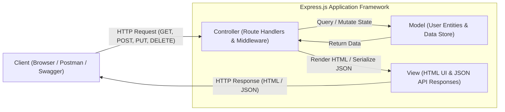

# 🎓 Alumni Tracking & Networking Platform

A scalable, modern web application designed to bridge the gap between institutions, students, and graduates. The platform enables alumni to maintain lifelong connections, track professional growth, share career opportunities, and foster community mentorship.

---

## 📌 Features & Modules

### 1. Profile & Portfolio Management
- **Professional Timeline:** Track employment history, current company, role, and industry.
- **Academic Background:** Record degrees, graduation years, departments, and certifications.
- **Social & Portfolios:** Connect LinkedIn, GitHub, and personal portfolio links.
- **Privacy Settings:** Manage profile visibility and contact information preferences.

### 2. Alumni Directory & Search
- **Multi-Criteria Search:** Filter alumni by name, graduation year, department, company, role, or city.
- **Interactive Directory:** Quick-connect cards with profile previews.
- **Location Insights:** Discover alumni working in specific regions or global hubs.

### 3. Career Hub & Opportunities
- **Job & Internship Board:** Alumni can post hiring opportunities from their organizations.
- **Internal Referral Network:** Connect job-seeking graduates directly with alumni.
- **Application Tracking:** Direct links to application portals and recruiter contacts.

### 4. Mentorship & Networking
- **Mentor Directory:** Match experienced alumni with junior peers and students for guidance.
- **Direct Messaging:** Secure communication channels between verified members.
- **Events & Webinars:** Organize reunions, tech talks, and professional meetups with RSVP tracking.

### 5. Administration & Role-Based Access (RBAC)
- **Account Verification:** Ensure authentic member registration via student/diploma verification.
- **Multi-Role System:** Distinct permission levels for Administrators, Alumni, and Students.
- **System Dashboard:** Visual statistics on employment distribution, industry trends, and community growth.

---

## 🛠️ Tech Stack

| Layer | Technology | Description |
| :--- | :--- | :--- |
| **Frontend** | HTML5, CSS3, JavaScript (ES6+) | Responsive, intuitive, and modern UI |
| **Backend** | Node.js, Express.js | Fast, scalable, and modular RESTful API architecture |
| **Database** | MySQL 8.0 | Relational database with normalized schema |
| **Containerization** | Docker, Docker Compose | Isolated, reproducible development and production environment |
| **Version Control** | Git & GitHub | Modular branching and codebase versioning |

---

## 🏛️ MVC (Model-View-Controller) Architecture

The application is structured following the **MVC (Model-View-Controller)** architectural pattern powered by the **Express.js** web application framework. This enforces a clean **Separation of Concerns (SoC)** across data persistence, routing control, and client presentation.



### 1. Model (Data & Entity Layer)
* **Responsibility:** Manages the data representation, state, and business validation rules for alumni and students.
* **Implementation:** 
  * The Model encapsulates the `mockUsers` data entity collection containing member records (`id`, `name`, `role`, `department`, `company`).
  * Enforces schema consistency and required field checks (e.g., verifying `name` and `role` before saving).
  * Designed for direct migration to relational database models (MySQL) without modifying controller logic.

### 2. View (Presentation & Serialization Layer)
* **Responsibility:** Formats and presents information back to the client. The application supports a dual presentation approach:
  * **Web UI Views (HTML):** Server-rendered pages delivered directly to web browsers for navigation (`/`, `/about`, `/users`).
  * **API JSON Views:** Structured JSON payloads (`res.json(...)`) returned to API clients, frontend applications, and mobile clients (`/api/health`, `/api/users`).
  * **Interactive Documentation View (Swagger UI):** OpenAPI 3.0 specification rendered at `/api/swagger` allowing real-time interactive endpoint testing.

### 3. Controller (Request Orchestration & Business Logic Layer)
* **Responsibility:** Connects the View and Model layers. Captures incoming HTTP requests, processes input parameters, directs model operations, and selects the corresponding view output.
* **Implementation:**
  * Implemented using **Express.js routing and middleware** (`express.json()`).
  * Handles parameter extraction from URL routes (`req.params.id`) and request bodies (`req.body`).
  * Manages standard HTTP status codes:
    * `200 OK`: Successful read or update (`GET`, `PUT`, `PATCH`).
    * `201 Created`: Successful resource addition (`POST`).
    * `400 Bad Request`: Input validation failures.
    * `404 Not Found`: Target resource not found.

---

### 📊 MVC Endpoint Mapping

| HTTP Method | Route | Controller Responsibility | Model Interaction | View Representation |
| :--- | :--- | :--- | :--- | :--- |
| `GET` | `/` & `/about` | Serves main navigation and informational pages | None | HTML Web Page |
| `GET` | `/users` | Formats and displays all members | Reads `mockUsers` | HTML Rendered View |
| `GET` | `/api/health` | Returns server health check diagnostics | System Uptime & Status | JSON (`{ status: "ok" }`) |
| `GET` | `/api/users` | Retrieves and delivers full member directory | Reads `mockUsers` | JSON Array (`[User]`) |
| `GET` | `/api/users/:id` | Fetches a single member by ID | Filters `mockUsers` | JSON Object or `404` |
| `POST` | `/api/users` | Validates payload and adds a new member | Appends to `mockUsers` | JSON Object + `201 Created` |
| `PUT` | `/api/users/:id` | Replaces an existing member's full profile | Updates `mockUsers[index]` | JSON Object + `200 OK` |
| `PATCH` | `/api/users/:id` | Partially modifies specified member fields | Updates target fields | JSON Object + `200 OK` |
| `DELETE` | `/api/users/:id` | Removes a member by ID | Splices from `mockUsers` | JSON Confirmation + `200 OK` |
| `GET` | `/api/swagger` | Serves interactive API testing dashboard | OpenAPI 3.0 Schema | Swagger UI Interface |

---

## 📂 Project Structure

```text
alumni/
├── backend/                  # Server-side source code
│   ├── src/
│   │   ├── config/           # Database and environment configurations
│   │   ├── controllers/      # Request handlers and business logic
│   │   ├── middlewares/      # Authentication & validation middlewares
│   │   ├── models/           # Database models and queries
│   │   ├── routes/           # API endpoints routing
│   │   └── app.js            # Express application entry point
│   ├── Dockerfile            # Backend Docker container setup
│   └── package.json          # Node.js dependencies and scripts
│
├── frontend/                 # Client-side interface
│   ├── public/               # Static assets (images, icons)
│   ├── src/
│   │   ├── css/              # Stylesheets
│   │   ├── js/               # Client-side logic & API requests
│   │   └── pages/            # HTML pages (dashboard, profiles, jobs)
│   └── Dockerfile            # Frontend web server configuration
│
├── database/                 # Database initialization
│   └── init.sql              # Initial schema and seed data
│
├── .gitignore                # Ignored files and directories
├── docker-compose.yml        # Multi-container orchestration
└── README.md                 # Project documentation
```

---

## 🚀 Getting Started

Follow these instructions to get a copy of the project up and running on your local machine.

### Prerequisites

Ensure you have the following installed:
- [Docker Desktop](https://www.docker.com/products/docker-desktop/) (version 20.10+)
- [Docker Compose](https://docs.docker.com/compose/)

---

### Installation & Setup

1. **Clone the Repository**
   ```bash
   git clone https://github.com/sevvalsudet/alumni.git
   cd alumni
   ```

2. **Environment Variables**
   Create a `.env` file in the root directory (or inside `backend/`):
   ```env
   PORT=5000
   DB_HOST=mysql
   DB_USER=alumni_user
   DB_PASSWORD=alumni_secret
   DB_NAME=alumni_db
   JWT_SECRET=your_jwt_secret_key
   ```

3. **Start the Application with Docker**
   Run the following command in the project root:
   ```bash
   docker-compose up --build
   ```

   This command will:
   - Spin up the **MySQL 8.0** container and initialize tables using `database/init.sql`.
   - Build and start the **Node.js Express** backend API.
   - Serve the **Frontend** web application.

4. **Access the Services**
   - **Frontend App:** [http://localhost:3000](http://localhost:3000)
   - **Backend API:** [http://localhost:5000](http://localhost:5000)
   - **MySQL Database:** `localhost:3306`

---

## 🔌 Core API Endpoints

| Method | Endpoint | Description |
| :--- | :--- | :--- |
| `POST` | `/api/auth/register` | Register a new user |
| `POST` | `/api/auth/login` | Authenticate user & return token |
| `GET` | `/api/alumni` | Retrieve list of alumni (supports query filters) |
| `GET` | `/api/alumni/:id` | Fetch detailed profile of an alumnus |
| `PUT` | `/api/alumni/:id` | Update profile information |
| `GET` | `/api/jobs` | List available jobs & internships |
| `POST` | `/api/jobs` | Post a new job opportunity |
| `GET` | `/api/events` | List upcoming community events |

---

## 📄 License

This project is licensed under the [MIT License](LICENSE).
